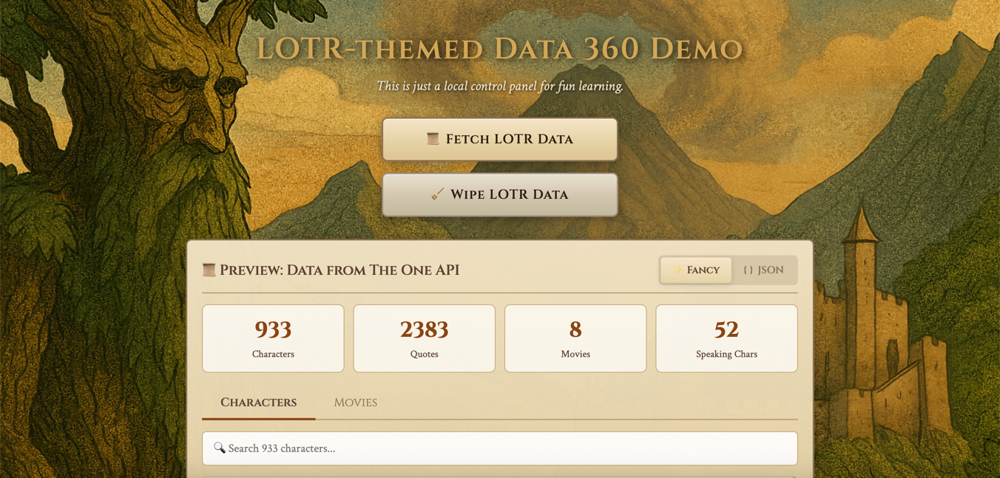
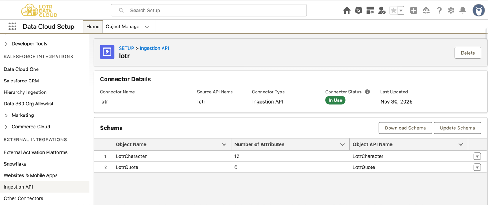
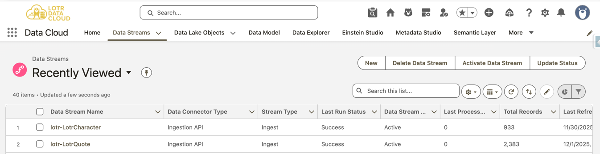
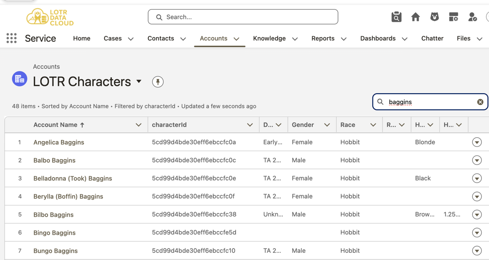
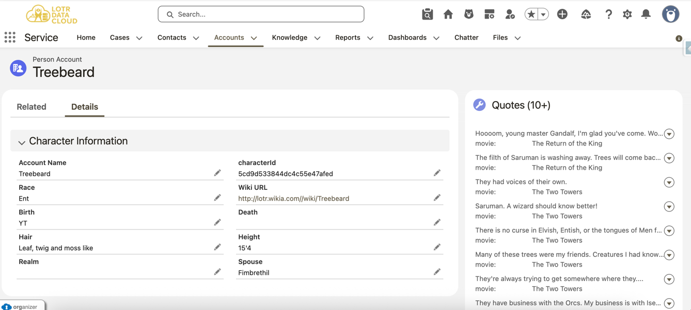
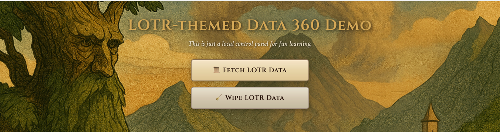
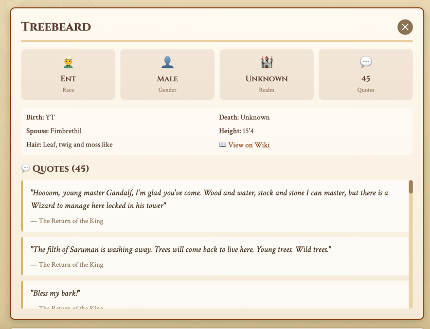

# 🌋 LOTR API to Data 360 Ingestion API POC

> *"One Ring to Rule Them All, One POC to Bind Them"*

A Python-based proof-of-concept that ingests Lord of the Rings character data from [The One API](https://the-one-api.dev) into Salesforce Data 360 via the Ingestion API, complete with a Flask web UI featuring LOTR-themed messaging.


*The One API - Source of our Middle-earth data*

## 🗺️ What This Does

- **Fetches** ~933 LOTR characters + 2,383 quotes from The One API
- **Ingests Characters** into Data 360 as `LotrCharacter` (Profile DMO)
- **Ingests Quotes** into Data 360 as `LotrQuote` (Engagement DMO)
- **Displays Quotes** on Person Account pages via **Data Cloud Related Lists**
- **Deletes** both characters and quotes using Bulk API
- **Triggers Salesforce Flows** via Data 360 → Account creation
- **Provides** a web UI to trigger ingestion/deletion with live status updates
- **Features** Gandalf-themed setup wizard and LOTR quotes throughout

## 🚀 Quick Start

### Prerequisites

- Python 3.8+
- A LOTR API key ([sign up here](https://the-one-api.dev/sign-up))
- Salesforce Data 360 org with admin access

### Installation

1. **Clone this repository:**
   ```bash
   git clone https://github.com/daviddarkins-accenture/lotr.git
   cd lotr
   ```

2. **Create and activate a virtual environment:**
   ```bash
   python3 -m venv venv
   source venv/bin/activate
   ```
   
   On Windows, use: `venv\Scripts\activate`

3. **Install dependencies:**
   ```bash
   pip install -r requirements.txt
   ```

4. **Set up Salesforce Data 360** (see [Salesforce Data 360 Setup](#-salesforce-data-360-setup) section below):
   - Create OAuth Connected App (Step 1)
   - Create Ingestion API Connector with `LotrCharacter` schema (Step 2)
   - Create Data Stream for `LotrCharacter` - Profile category (Step 3)
   - Create Data Stream for `LotrQuote` - Engagement category (Step 4)
   - Configure Identity Resolution (Step 5)
   - Configure Data Cloud Related Lists (Step 6)
   - Deploy Salesforce metadata (Step 7)

5. **Configure environment variables:**
   
   **Option A - Use the setup wizard (Recommended):**
   ```bash
   python setup.py
   ```
   
   The wizard will guide you through:
   1. **LOTR API Key** - Get one at https://the-one-api.dev/sign-up
   2. **Data Cloud Client ID** - From your OAuth Connected App
   3. **Data Cloud Client Secret** - From your OAuth Connected App
   4. **Data Cloud Auth URL** - Default: `https://login.salesforce.com` (or your sandbox URL)
   5. **Data Cloud Ingestion API URL** - Your Data 360 instance URL (e.g., `https://your-instance.c360a.salesforce.com`)
   6. **Source API Name** - Default: `lotr` (must match your Data Stream configuration)
   7. **Object API Name** - Default: `LotrCharacter` (must match your Data Stream configuration)
   
   This creates a `.env` file with all your credentials.
   
   **Option B - Manual setup:**
   ```bash
   cp .env.example .env
   # Edit .env with your actual credentials
   ```

6. **Start the Flask app:**
   ```bash
   python app.py
   ```
   
   Or use the quick start script: `./start.sh`

7. **Open your browser:**
   ```
   http://localhost:5001
   ```

8. **Click "Fetch LOTR Data 📜"** to load characters and quotes
9. **Click "Send Characters 🌋"** to ingest character data
10. **Click "Send Quotes 💬"** to ingest quotes (for Related Lists!)


*Data 360 Data Stream configuration*


*Data appearing in Data 360 after ingestion*

## 📦 Project Structure

```
lotr/
├── schema/
│   ├── lotr_character.yaml     # Character schema (Profile DMO)
│   ├── lotr_quote.yaml         # Quote schema (Engagement DMO)
│   └── lotr_schema.yaml        # Combined schema for Data 360
├── static/                     # Flask static files
│   ├── bg.png                  # Background image
│   ├── style.css               # UI styling
│   └── app.js                  # Frontend JavaScript
├── templates/
│   └── index.html              # Main UI template
├── SFDC/lotr/
│   ├── force-app/              # Salesforce metadata
│   └── manifest/               # Package manifest
├── assets/                     # Screenshots and images
├── app.py                      # Flask web application
├── auth.py                     # Data 360 OAuth2 + Token Exchange
├── config.py                   # Configuration validation
├── deletion.py                 # Bulk API deletion pipeline
├── ingestion.py                # Streaming ingestion pipeline
├── lotr_client.py              # LOTR API client
├── setup.py                    # Gandalf's setup wizard
├── requirements.txt            # Python dependencies
└── README.md                   # This file
```

## 🔑 Key Technical Details

### Authentication (Two-Step Token Exchange)

Data 360 requires a **two-step authentication**:

1. **Get Salesforce Access Token** (Client Credentials Flow)
   ```
   POST {auth_url}/services/oauth2/token
   grant_type=client_credentials
   ```

2. **Exchange for Data 360 Token**
   ```
   POST {instance_url}/services/a360/token
   grant_type=urn:salesforce:grant-type:external:cdp
   subject_token={salesforce_token}
   ```

This returns a JWT token and the Data 360 instance URL (`*.c360a.salesforce.com`).

**Reference:** [Data Cloud Developer Guide](https://developer.salesforce.com/docs/atlas.en-us.c360a_api.meta/c360a_api/c360a_api_get_token.htm)

### Ingestion (Streaming API)

```
POST https://{dc_instance}/api/v1/ingest/sources/{source}/{object}
Authorization: Bearer {dc_token}
Content-Type: application/json

{"data": [{...record...}, {...record...}]}
```

**Important:**
- All schema fields must be present (use empty string for missing values)
- Processing is async (~3 minutes)
- Returns `202 Accepted`

**Reference:** [Streaming Ingestion API](https://developer.salesforce.com/docs/atlas.en-us.c360a_api.meta/c360a_api/c360a_api_streaming_ingest.htm)

### Deletion (Bulk API)

Streaming DELETE doesn't work with "Upsert" refresh mode. Must use **Bulk API**:

```python
# 1. Create job
POST /api/v1/ingest/jobs
{"object": "LotrCharacter", "sourceName": "lotr", "operation": "delete"}

# 2. Upload CSV (NO HEADER, 2 columns for Profile category)
PUT /api/v1/ingest/jobs/{id}/batches
"primary_key_value","datetime_greater_than_ingestedAt"

# 3. Close job
PATCH /api/v1/ingest/jobs/{id}
{"state": "UploadComplete"}
```

**CSV Format for Profile Category:**
```csv
"5cd99d4bde30eff6ebccfbbe","2025-12-01T03:12:50.000Z"
"5cd99d4bde30eff6ebccfc15","2025-12-01T03:12:50.000Z"
```

## 💬 Data Cloud Related Lists

This POC demonstrates how to show Data 360 data directly on Salesforce record pages using **Data Cloud Related Lists**.


*LOTR Characters as Person Accounts in Salesforce*


*Data Cloud Related List showing quotes on Treebeard's Account page*

### How It Works

1. **LotrQuote** is configured as an **Engagement** category DMO
2. Quotes link to **Account** via `characterId`
3. A **Data Cloud Related List** displays quotes on Person Account pages

### Setup Requirements

- DMO Category: **Engagement** (required for Related Lists!)
- Primary Key: `quoteId`
- Event Time Field: `ingestedAt`
- Relationship: `LotrQuote.characterId` → `Account.characterId`

## 🏗️ Salesforce Data 360 Setup

### Step 1: Create OAuth Connected App

1. Navigate to **Setup** → **App Manager** → **New Connected App**
2. Fill in basic information:
   - **Connected App Name**: `LOTR Data Cloud Ingestion`
   - **API Name**: `LOTR_Data_Cloud_Ingestion`
   - **Contact Email**: Your email
3. Enable OAuth Settings:
   - Check **Enable OAuth Settings**
   - **Callback URL**: `https://localhost` (not used for Client Credentials flow, but required)
   - **Selected OAuth Scopes**: Add these scopes:
     - `cdp_ingest_api` (required for Data Cloud Ingestion API)
     - `api` (required for general API access)
     - `refresh_token, offline_access` (for token refresh)
4. **Enable Client Credentials Flow**:
   - Check **Enable Client Credentials Flow**
   - This allows server-to-server authentication without user interaction
5. Set **Run As** user in OAuth Policies:
   - **Permitted Users**: Select a specific user (recommended) or "All users may self-authorize"
   - **IP Relaxation**: "Relax IP restrictions" (for development) or configure specific IPs
6. **Save** the Connected App
7. **Note your credentials**:
   - **Consumer Key** (this is your Client ID)
   - **Consumer Secret** (this is your Client Secret) - click "Click to reveal" to see it

**Reference:** [Create a Connected App](https://help.salesforce.com/s/articleView?id=sf.connected_app_create.htm)

### Step 2: Create Ingestion API Connector

1. Navigate to **Data Cloud Setup** → **Ingestion API** → **New**
2. Configure the connector:
   - **Connector API Name**: `lotr` (must match your `.env` file `DATA_CLOUD_SOURCE_NAME`)
   - **Description**: "LOTR Character and Quote Data"
3. **Upload Schema**:
   - Click **Upload Schema**
   - Upload the file: `schema/lotr_character.yaml`
   - This creates the `LotrCharacter` object definition
4. **Save** the connector

**Note:** You'll create a second schema for quotes later. For now, we're setting up the character (Profile) data stream first.

**Reference:** [Create an Ingestion API Connector](https://help.salesforce.com/s/articleView?id=sf.c360a_ingestion_api_connector.htm)

### Step 3: Create Data Stream for LotrCharacter (Profile)

1. In your **Ingestion API Connector** (`lotr`), click **Create Data Stream**
2. Configure the data stream:

   | Setting | Value | Notes |
   |---------|-------|-------|
   | **Object API Name** | `LotrCharacter` | Must match schema object name |
   | **Category** | **Profile** | Profile data represents stable identity |
   | **Primary Key** | `characterId` | Unique identifier for deduplication |
   | **Record Modified Field** | `ingestedAt` | DateTime field for change detection |
   | **Refresh Mode** | `Upsert` | Updates existing records or creates new ones |

3. **Field Mappings** (if prompted):
   - Verify all fields from your schema are mapped correctly
   - Ensure `characterId` is set as the Primary Key
   - Ensure `ingestedAt` is set as the Record Modified Field

4. **Deploy** the data stream:
   - Click **Deploy**
   - Wait for deployment to complete (typically 1-2 minutes)
   - Status should show "Deployed" or "Active"

5. **Note the Data Lake Object API Name**:
   - After deployment, go to **Data Streams** → Select `lotr-LotrCharacter`
   - Click the **Data Lake Object** tab
   - Copy the **API Name** (format: `lotr_LotrCharacter_{orgId}__dlm`)
   - Example: `lotr_LotrCharacter_D737044C__dlm`
   - **You'll need this for the Flow configuration later!**

**Reference:** [Create a Data Stream](https://help.salesforce.com/s/articleView?id=sf.c360a_data_stream_create.htm)

### Step 4: Create Data Stream for LotrQuote (Engagement)

1. **Add Quote Schema to Connector**:
   - Go back to your **Ingestion API Connector** (`lotr`)
   - Click **Edit** → **Upload Schema** (or **Add Schema**)
   - Upload the file: `schema/lotr_quote.yaml`
   - This adds the `LotrQuote` object definition

2. **Create Data Stream for Quotes**:
   - In the connector, click **Create Data Stream** again
   - Configure the data stream:

   | Setting | Value | Notes |
   |---------|-------|-------|
   | **Object API Name** | `LotrQuote` | Must match schema object name |
   | **Category** | **Engagement** | Engagement data for Related Lists |
   | **Primary Key** | `quoteId` | Unique identifier for each quote |
   | **Event Time Field** | `ingestedAt` | Required for Engagement category |
   | **Refresh Mode** | `Upsert` | Updates existing records or creates new ones |

3. **Deploy** the quote data stream:
   - Click **Deploy**
   - Wait for deployment to complete

**Important:** The **Engagement** category is required for Data Cloud Related Lists to work!

**Reference:** [Engagement Data Model Objects](https://help.salesforce.com/s/articleView?id=sf.c360a_engagement_dmo.htm)

### Step 5: Configure Identity Resolution

Identity Resolution links Data Cloud profiles to Salesforce records (Person Accounts in this case).

1. Navigate to **Data Cloud Setup** → **Identity Resolution** → **Identity Resolution Rules**

2. **Create or Edit Identity Resolution Rule**:
   - If no rule exists, click **New**
   - If a default rule exists, click **Edit**

3. **Configure Matching**:
   - **Match Type**: Select how to match profiles to Salesforce records
   - For this POC, we'll use **Email** or **External ID** matching
   - Since LOTR characters don't have emails, we'll use a custom field match

4. **Add Matching Rule**:
   - **Source Field**: `LotrCharacter.characterId`
   - **Target Field**: `Account.characterId__c` (custom field we'll deploy)
   - **Match Type**: Exact Match
   - **Priority**: 1

5. **Enable the Rule**:
   - Toggle the rule to **Active**
   - **Save** the rule

6. **Run Identity Resolution** (optional, for existing data):
   - Navigate to **Data Cloud Setup** → **Identity Resolution** → **Run Identity Resolution**
   - Select your rule and click **Run**
   - This links existing Data Cloud profiles to Salesforce Accounts

**Note:** Identity Resolution runs automatically when new profiles are created, but you may need to run it manually for existing data.

**Reference:** [Identity Resolution in Data Cloud](https://help.salesforce.com/s/articleView?id=sf.c360a_identity_resolution.htm)

### Step 6: Configure Data Cloud Related Lists

Data Cloud Related Lists allow you to display Engagement data (quotes) directly on Salesforce record pages.

1. **Enable Related Lists** (if not already enabled):
   - Navigate to **Data Cloud Setup** → **Related Lists**
   - Ensure Related Lists are enabled for your org

2. **Create Related List for Quotes**:
   - Navigate to **Data Cloud Setup** → **Related Lists** → **New**
   - Configure the Related List:

   | Setting | Value | Notes |
   |---------|-------|-------|
   | **Name** | `LOTR Quotes` | Display name for the related list |
   | **API Name** | `LOTR_Quotes` | Internal API name |
   | **Data Model Object** | `LotrQuote` | The Engagement DMO |
   | **Related To Object** | `Account` | Salesforce object to show quotes on |
   | **Relationship Field** | `characterId` | Field in LotrQuote that links to Account |
   | **Account Field** | `characterId__c` | Custom field on Account that stores character ID |
   | **Display Fields** | Select: `dialog`, `movie`, `characterName`, `ingestedAt` | Fields to show in the list |

3. **Configure Display Settings**:
   - **List Label**: "LOTR Quotes" (or "Quotes")
   - **List Icon**: Choose an appropriate icon
   - **Sort By**: `ingestedAt` (descending - newest first)
   - **Records Per Page**: 25 (default)

4. **Save** the Related List

5. **Add to Page Layout** (if not automatic):
   - Navigate to **Setup** → **Object Manager** → **Account** → **Page Layouts**
   - Edit your Person Account page layout
   - In the **Related Lists** section, ensure "LOTR Quotes" appears
   - If it doesn't, add it manually

**Reference:** [Data Cloud Related Lists](https://help.salesforce.com/s/articleView?id=sf.c360a_related_lists.htm)

### Step 7: Deploy Salesforce Metadata

Deploy the custom fields, permission sets, flows, and page layouts to your Salesforce org.


*The One API - Source of our Middle-earth data*

1. **Authenticate with Salesforce CLI**:
   ```bash
   cd SFDC/lotr
   sf org login web --alias lotr-dev
   ```
   Or if you already have an org authenticated:
   ```bash
   sf org list
   ```

2. **Deploy Custom Fields and Objects**:
   ```bash
   # Deploy Account custom fields
   sf project deploy start --source-dir force-app/main/default/objects/Account
   ```

3. **Deploy Permission Set**:
   ```bash
   # Deploy the LOTR permission set (grants access to custom fields)
   sf project deploy start --source-dir force-app/main/default/permissionsets
   ```

4. **Assign Permission Set to Users**:
   - In Salesforce Setup, go to **Users** → **Permission Sets** → **lotr**
   - Click **Manage Assignments** → **Add Assignments**
   - Select users who need access to LOTR character data
   - Click **Assign**

5. **Update and Deploy Flow** (for automatic Person Account creation):
   
   **First, find your Data Cloud object API name:**
   - Go to **Data Cloud Setup** → **Data Streams** → Select `lotr-LotrCharacter`
   - Click the **Data Lake Object** tab
   - Copy the **API Name** (format: `lotr_LotrCharacter_{orgId}__dlm`)
   - Example: `lotr_LotrCharacter_D737044C__dlm`
   
   **Update the Flow metadata:**
   - Open `SFDC/lotr/force-app/main/default/flows/lotrCreateAccount.flow-meta.xml`
   - Find line 111 (the `<object>` tag in the `<start>` element)
   - Replace `lotr_LotrCharacter_D737044C__dlm` with your actual object API name
   - The `D737044C` part is org-specific — you'll have a different identifier
   
   **Deploy the Flow:**
   ```bash
   sf project deploy start --source-dir force-app/main/default/flows
   ```
   
   **Activate the Flow:**
   - In Salesforce Setup, go to **Flows** → **lotrCreateAccount**
   - Click **Activate** (if not already active)
   - This flow will automatically create Person Accounts when characters are ingested into Data Cloud

6. **Deploy Page Layout** (includes Related List configuration):
   ```bash
   sf project deploy start --source-dir force-app/main/default/flexipages
   ```

7. **Verify Deployment**:
   - Check deployment status: `sf project deploy report`
   - In Salesforce, verify:
     - Custom fields appear on Account object
     - Permission set is available
     - Flow is active
     - Page layout includes the Related List

**Reference:** [Deploy Metadata with Salesforce CLI](https://developer.salesforce.com/docs/atlas.en-us.sfdx_cli_reference.meta/sfdx_cli_reference/cli_reference_force_commands.htm)

### Step 8: Note Data 360 Instance URL

After deploying your data streams, find the **Ingestion API endpoint**:

1. Go to **Data Cloud Setup** → **Ingestion API** → Select your `lotr` connector
2. Find the **Ingestion API Endpoint** URL
3. It will look like: `https://{subdomain}.c360a.salesforce.com`
4. **Copy this URL** - you'll need it for your `.env` file (`DATA_CLOUD_INGESTION_URL`)

**Alternative:** This URL is also returned by the token exchange process when you authenticate, so you can get it programmatically as well.

---

**Reference:** [Data Cloud Connectors and Integrations (Trailhead)](https://trailhead.salesforce.com/content/learn/modules/data-cloud-connectors-and-integrations)

## ✅ Validation

After ingestion, verify in Data 360 Data Explorer:

**Characters:**
- Select Object: `lotr-LotrCharacter`
- Should see ~933 records

**Quotes:**
- Select Object: `lotr-LotrQuote`
- Should see ~2,383 records

**Related Lists:**
- Open a Person Account (e.g., "Treebeard" or "Bilbo Baggins")
- Quotes should appear in the Related List panel


*Example: Treebeard character profile with related quotes*

After deletion:
- Check Data Stream Refresh History for "Delete" operations
- Both Character and Quote records should go to 0

## 🔐 Security Notes

- **Never commit `.env`** - it contains your secrets
- All API calls happen **server-side** in Flask
- Browser never sees your credentials
- Keep your LOTR API key and Data 360 credentials safe

## 🧙‍♂️ Troubleshooting

**"Configuration Incomplete!" error:**
- Run `python setup.py` to set up your `.env` file

**"400 Bad Request" on ingestion:**
- Check that all schema fields are present (even with empty strings)
- Verify schema matches Data Stream configuration
- Ensure you're using Data 360 token (not Salesforce token)

**"Deletes not working":**
- Streaming DELETE doesn't work with Upsert refresh mode
- Must use Bulk API for deletes
- CSV must have NO header
- For Profile category, need 2 columns: primary key + future datetime

**Data not appearing after ingestion:**
- Processing is async (~3 minutes)
- Check Data Stream Refresh History for job status

**"401 Unauthorized" errors:**
- Verify Connected App has correct scopes
- Check Client Credentials Flow is enabled
- Verify Run As user is set in policies

## 🌠 Future Enhancements

- Link Salesforce Contacts to favorite LOTR characters
- Create behavioral event tracking (e.g., "viewed character profile")
- Deploy Agentforce to answer questions about customer LOTR preferences
- Build Data Actions to trigger campaigns based on character affinities

## 📝 License

MIT - This is a learning POC, not a production system.

---

## 📚 Additional Resources

- [Data Cloud Developer Guide](https://developer.salesforce.com/docs/atlas.en-us.c360a_api.meta/c360a_api/c360a_api_quick_start.htm)
- [Data Cloud Connectors and Integrations (Trailhead)](https://trailhead.salesforce.com/content/learn/modules/data-cloud-connectors-and-integrations)
- [Data Cloud Quick Look (Trailhead)](https://trailhead.salesforce.com/content/learn/modules/data-cloud-quick-look)
- [The One API Documentation](https://the-one-api.dev/documentation)

---

*"Even the smallest person can change the course of the future." - Gandalf*

Now go forth and ingest data like the hero Middle-earth needs! 🚀
