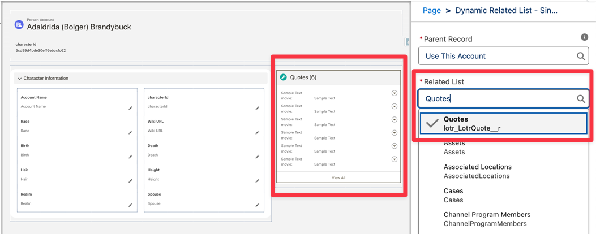

# 🌋 LOTR API to Data 360 Ingestion API POC

> *"One Ring to Rule Them All, One POC to Bind Them"*

A Python-based proof-of-concept that ingests Lord of the Rings character data from [The One API](https://the-one-api.dev) into Salesforce Data 360 via the Ingestion API, complete with a Flask web UI featuring LOTR-themed messaging.

**Note:** "Data 360" and "Data Cloud" are used interchangeably in this documentation—both refer to Salesforce's customer data platform.

## Table of Contents

1. [What This Does](#-what-this-does)
2. [Quick Start](#-quick-start)
3. [Architecture at a Glance](#-architecture-at-a-glance)
4. [Configuration](#-configuration)
5. [Salesforce/Data 360 Setup](#-salesforcedata-360-setup)
6. [Validate](#-validate)
7. [Troubleshooting](#-troubleshooting)
8. [Security](#-security)
9. [Project Structure](#-project-structure)
10. [License & Resources](#-license--resources)

## 🗺️ What This Does

- **Fetches** ~933 LOTR characters + 2,383 quotes from The One API
- **Ingests Characters** into Data 360 as `LotrCharacter` (Profile DMO)
- **Ingests Quotes** into Data 360 as `LotrQuote` (Engagement DMO)
- **Displays Quotes** on Person Account pages via **Data Cloud Related Lists**
- **Deletes** both characters and quotes using Bulk API
- **Triggers Salesforce Flows** via Data 360 → Account creation
- **Provides** a web UI to trigger ingestion/deletion with live status updates

## 🚀 Quick Start

**Prerequisites:** Python 3.8+, LOTR API key ([sign up](https://the-one-api.dev/sign-up)), Salesforce Data 360 org with admin access

```bash
# Clone and setup
git clone https://github.com/daviddarkins-accenture/lotr.git
cd lotr
python3 -m venv venv
source venv/bin/activate  # Windows: venv\Scripts\activate
pip install -r requirements.txt

# Configure (wizard recommended)
python setup.py

# Start Flask app
python app.py
# Open http://localhost:5001
```

**Before ingesting data:** Complete [Salesforce/Data 360 Setup](#-salesforcedata-360-setup) (Steps 1-10).

**Then:** Click "Fetch LOTR Data 📜" → "Send Characters 🌋" → "Send Quotes 💬"


*The One API - Source of our Middle-earth data*

## 🏗️ Architecture at a Glance

### Data Objects

- **LotrCharacter** (Profile DMO): Stable identity data (~933 characters)
  - Primary Key: `characterId`
  - Category: Profile
  - Links to Salesforce Person Accounts via `characterId__c` field

- **LotrQuote** (Engagement DMO): Activity data (~2,383 quotes)
  - Primary Key: `quoteId`
  - Category: Engagement (required for Related Lists)
  - Event Time: `ingestedAt`
  - Links to Account via `characterId` → `Account.characterId__c`

### Related Lists

Quotes display on Person Account pages through Data Cloud Related Lists:
- `LotrQuote.characterId` → `Account.characterId__c` relationship
- Engagement category enables Related List functionality

### Authentication Flow

Two-step token exchange:
1. Get Salesforce token: `POST {auth_url}/services/oauth2/token` (Client Credentials)
2. Exchange for Data 360 JWT: `POST {instance_url}/services/a360/token`
3. Use JWT for all Ingestion API calls

### Ingestion

- **Endpoint:** `POST https://{dc_instance}/api/v1/ingest/sources/{source}/{object}`
- **Response:** `202 Accepted` (async processing ~3 minutes)
- **Requirement:** All schema fields must be present (use empty string for nulls)

### Deletion

Streaming DELETE doesn't work with Upsert refresh mode. Use **Bulk API**:
- Create job: `POST /api/v1/ingest/jobs` with `{"operation": "delete"}`
- Upload CSV (NO HEADER): `"primary_key","future_datetime"`
- Profile category requires 2 columns: primary key + future datetime

## ⚙️ Configuration

### Option A: Setup Wizard (Recommended)

```bash
python setup.py
```

Prompts for:
1. LOTR API Key
2. Data Cloud Client ID (from OAuth Connected App)
3. Data Cloud Client Secret
4. Data Cloud Auth URL (default: `https://login.salesforce.com`)
5. Data Cloud Ingestion API URL (e.g., `https://your-instance.c360a.salesforce.com`)
6. Source API Name (default: `lotr`)
7. Object API Name (default: `LotrCharacter`)

Creates `.env` file automatically.

### Option B: Manual Setup

```bash
cp .env.example .env
# Edit .env with your credentials
```

## 🏗️ Salesforce/Data 360 Setup

Complete these steps in order before ingesting data.

### Step 1: Create OAuth Connected App

<details>
<summary>Click for detailed steps</summary>

1. **Setup** → **App Manager** → **New Connected App**
2. Basic info: Name `LOTR Data Cloud Ingestion`, API Name `LOTR_Data_Cloud_Ingestion`
3. Enable OAuth Settings:
   - Callback URL: `https://localhost`
   - Scopes: `cdp_ingest_api`, `api`, `refresh_token, offline_access`
4. Enable **Client Credentials Flow**
5. OAuth Policies: Set Run As user, relax IP restrictions (dev)
6. Save and note **Consumer Key** (Client ID) and **Consumer Secret** (Client Secret)

**Reference:** [Create a Connected App](https://help.salesforce.com/s/articleView?id=sf.connected_app_create.htm)
</details>

### Step 2: Create Ingestion API Connector

<details>
<summary>Click for detailed steps</summary>

1. **Data Cloud Setup** → **Ingestion API** → **New**
2. Connector API Name: `lotr` (must match `.env` `DATA_CLOUD_SOURCE_NAME`)
3. Upload Schema: `schema/lotr_schema.yaml` (contains both `LotrCharacter` and `LotrQuote`)
4. Save

**Reference:** [Create an Ingestion API Connector](https://help.salesforce.com/s/articleView?id=sf.c360a_ingestion_api_connector.htm)
</details>

### Step 3: Create Data Stream for LotrCharacter (Profile)

<details>
<summary>Click for detailed steps</summary>

1. **Data Cloud Setup** → **Data Streams** → **New**
2. Connector: `lotr`, Object: `LotrCharacter`
3. Configure:
   - Category: **Profile**
   - Primary Key: `characterId`
   - Record Modified Field: `ingestedAt`
   - Refresh Mode: `Upsert`
4. Deploy (wait 1-2 minutes)
5. **Note DLO API Name:** Data Streams → `lotr-LotrCharacter` → Data Lake Object tab → Copy API Name (format: `lotr_LotrCharacter_{orgId}__dlm`) — **needed for Flow later**

**Reference:** [Create a Data Stream](https://help.salesforce.com/s/articleView?id=sf.c360a_data_stream_create.htm)
</details>

### Step 4: Create Data Stream for LotrQuote (Engagement)

<details>
<summary>Click for detailed steps</summary>

1. **Data Streams** → **New**
2. Connector: `lotr`, Object: `LotrQuote`
3. Configure:
   - Category: **Engagement** (required for Related Lists)
   - Primary Key: `quoteId`
   - Event Time Field: `ingestedAt`
   - Refresh Mode: `Upsert`
4. Deploy

**Reference:** [Engagement Data Model Objects](https://help.salesforce.com/s/articleView?id=sf.c360a_engagement_dmo.htm)
</details>

### Step 5: Deploy Custom Account Fields and Permission Set

<details>
<summary>Click for detailed steps</summary>

```bash
cd SFDC/lotr
sf org login web --alias lotr-dev
sf project deploy start --source-dir force-app/main/default/objects/Account
sf project deploy start --source-dir force-app/main/default/permissionsets
```

Then in Salesforce: **Users** → **Permission Sets** → **lotr** → **Manage Assignments** → Assign to users

**Reference:** [Deploy Metadata with Salesforce CLI](https://developer.salesforce.com/docs/atlas.en-us.sfdx_cli_reference.meta/sfdx_cli_reference/cli_reference_force_commands.htm)
</details>

### Step 6: Add Salesforce CRM Account to Data Stream

<details>
<summary>Click for detailed steps</summary>

1. **Data Streams** → **New**
2. Connector: **CRM**, Object: **Account**
3. Configure:
   - Category: **Profile**
   - Primary Key: `Id`
   - Record Modified Field: `LastModifiedDate`
   - Refresh Mode: `Upsert`
4. Deploy

**Reference:** [Add CRM Data to Data Cloud](https://help.salesforce.com/s/articleView?id=sf.c360a_add_crm_data.htm)
</details>

### Step 7: Configure DLO Mapping

<details>
<summary>Click for detailed steps</summary>

DLOs are automatically created when you deploy Data Streams, but mapping to Salesforce objects must be configured manually.

**For LotrCharacter:**
1. **Data Streams** → `lotr-LotrCharacter` → **Data Mapping** → **Start**
2. **Select Object** → **Custom Object**
3. Deploy mapping
4. Note DLO API Name

**For Account:**
1. **Data Streams** → Account CRM stream → **Data Mapping** → **Start**
2. **Select Object** → **Account**
3. Configure mapping between LotrCharacter and Account

**For LotrQuote:**
1. **Data Streams** → `lotr-LotrQuote` → **Data Mapping** → **Start**
2. **Select Object** → **Custom Object**
3. Deploy mapping

**Add Relationships:**
- In DLO mapping, add relationship: LotrCharacter → Quote
- Add relationship: LotrCharacter → Account

**Reference:** [Data Lake Objects in Data Cloud](https://help.salesforce.com/s/articleView?id=sf.c360a_data_lake_objects.htm)
</details>

### Step 8: Configure Identity Resolution

<details>
<summary>Click for detailed steps</summary>

1. **Identity Resolution** → **New**
2. Create/Edit rule
3. Match Type: **External ID**
4. Add Matching Rule:
   - Source: `LotrCharacter.characterId`
   - Target: `Account.characterId__c`
   - Match Type: Exact Match
   - Priority: 1
5. Enable and Save
6. (Optional) Run Identity Resolution for existing data

**Reference:** [Identity Resolution in Data Cloud](https://help.salesforce.com/s/articleView?id=sf.c360a_identity_resolution.htm)
</details>

### Step 9: Configure Data Cloud Related Lists

<details>
<summary>Click for detailed steps</summary>

1. **Data Cloud Setup** → **Related Lists** → **New**
2. Configure:
   - Name: `LOTR Quotes`
   - Data Model Object: `LotrQuote`
   - Related To: `Account`
   - Relationship Field: `characterId`
   - Account Field: `characterId__c`
   - Display Fields: `dialog`, `movie`, `characterName`, `ingestedAt`
3. Save

**Add Related List to Account Page Layout:**

After creating the Related List in Data Cloud, you need to manually add it to the Account page layout:

1. Navigate to **Setup** → **Object Manager** → **Account** → **Page Layouts** → **Account Layout** (or your custom layout)
2. Click **Edit** on the layout
3. In the **Related Lists** section, click **Related Lists** in the palette
4. Drag **Quotes** (or `lotr_LotrQuote__r`) to the Related Lists section on the layout
5. Save the layout


*Configuring the Dynamic Related List component: Select "Quotes" (lotr_LotrQuote__r) from the Related List dropdown*

**Reference:** [Data Cloud Related Lists](https://help.salesforce.com/s/articleView?id=sf.c360a_related_lists.htm)
</details>

### Step 10: Deploy Remaining Salesforce Metadata

<details>
<summary>Click for detailed steps</summary>

**Update Flow with DLO API Name:**
1. Find DLO API Name: Data Streams → `lotr-LotrCharacter` → Data Lake Object tab
2. Edit `SFDC/lotr/force-app/main/default/flows/lotrCreateAccount.flow-meta.xml` line 111
3. Replace `lotr_LotrCharacter_D737044C__dlm` with your actual DLO API name

**Deploy:**
```bash
sf project deploy start --source-dir force-app/main/default/flows
sf project deploy start --source-dir force-app/main/default/flexipages
```

**Activate Flow:** Setup → Flows → `lotrCreateAccount` → Activate

**Reference:** [Deploy Metadata with Salesforce CLI](https://developer.salesforce.com/docs/atlas.en-us.sfdx_cli_reference.meta/sfdx_cli_reference/cli_reference_force_commands.htm)
</details>

### Step 11: Run Ingestion and Verify in Data Cloud

<details>
<summary>Click for detailed steps</summary>

1. **Start the Flask app:**
   ```bash
   python app.py
   ```

2. **Open browser:** `http://localhost:5001`

3. **Fetch data:**
   - Click **"Fetch LOTR Data 📜"** to load characters and quotes from The One API

4. **Ingest characters:**
   - Click **"Send Characters 🌋"** to ingest character data into Data 360
   - Wait for confirmation message

5. **Ingest quotes:**
   - Click **"Send Quotes 💬"** to ingest quotes into Data 360
   - Wait for confirmation message

6. **Verify in Data Cloud:**
   - Navigate to **Data Cloud Setup** → **Data Streams**
   - Select `lotr-LotrCharacter` → Check **Total Records** (~933)
   - Select `lotr-LotrQuote` → Check **Total Records** (~2,383)
   - Review **Data Stream Refresh History** for successful ingestion jobs

7. **Verify in Salesforce:**
   - Check that Person Accounts were created (if Flow is active)
   - Open a Person Account → Verify Related List shows quotes
</details>

**Note:** Additional setup screenshots available in `/assets` gallery.

## ✅ Validate

**In Data 360 Data Explorer:**
- `lotr-LotrCharacter`: ~933 records
- `lotr-LotrQuote`: ~2,383 records

**In Salesforce:**
- Open Person Account (e.g., "Treebeard" or "Bilbo Baggins")
- Quotes appear in Related List panel


*Data Cloud Related List showing quotes on Treebeard's Account page*

**After deletion:**
- Data Stream Refresh History shows "Delete" operations
- Record counts return to 0

## 🧙‍♂️ Troubleshooting

**"Configuration Incomplete!"**
- Run `python setup.py` to create `.env`

**"400 Bad Request" on ingestion**
- All schema fields must be present (use empty strings for nulls)
- Verify schema matches Data Stream configuration
- Ensure using Data 360 JWT token (not Salesforce token)

**"Deletes not working"**
- Streaming DELETE doesn't work with Upsert refresh mode
- Use Bulk API: CSV with NO header, 2 columns for Profile category (primary key + future datetime)

**Data not appearing after ingestion**
- Processing is async (~3 minutes)
- Check Data Stream Refresh History for job status

**"401 Unauthorized"**
- Verify Connected App has `cdp_ingest_api` scope
- Check Client Credentials Flow is enabled
- Verify Run As user is set in OAuth policies

## 🔐 Security

- **Never commit `.env`** — contains secrets
- All API calls are server-side in Flask
- Browser never sees credentials
- Keep LOTR API key and Data 360 credentials secure

## 📦 Project Structure

```
lotr/
├── schema/
│   ├── lotr_character.yaml     # Character schema (Profile DMO)
│   ├── lotr_quote.yaml         # Quote schema (Engagement DMO)
│   └── lotr_schema.yaml        # Combined schema for Data 360
├── static/                     # Flask static files
├── templates/                  # HTML templates
├── SFDC/lotr/
│   ├── force-app/              # Salesforce metadata
│   └── manifest/               # Package manifest
├── assets/                     # Screenshots and images
├── app.py                      # Flask web application
├── auth.py                     # Data 360 OAuth2 + Token Exchange
├── config.py                   # Configuration validation
├── deletion.py                 # Bulk API deletion pipeline
├── ingestion.py                # Streaming ingestion pipeline
├── lotr_client.py              # LOTR API client
├── setup.py                    # Setup wizard
└── requirements.txt            # Python dependencies
```

## 📝 License & Resources

**License:** MIT - This is a learning POC, not a production system.

**Documentation:**
- [Data Cloud Developer Guide](https://developer.salesforce.com/docs/atlas.en-us.c360a_api.meta/c360a_api/c360a_api_get_token.htm)
- [Data Cloud Connectors and Integrations (Trailhead)](https://trailhead.salesforce.com/content/learn/modules/data-cloud-connectors-and-integrations)
- [Data Cloud Quick Look (Trailhead)](https://trailhead.salesforce.com/content/learn/modules/data-cloud-quick-look)
- [The One API Documentation](https://the-one-api.dev/documentation)

---

*"Even the smallest person can change the course of the future." - Gandalf*
